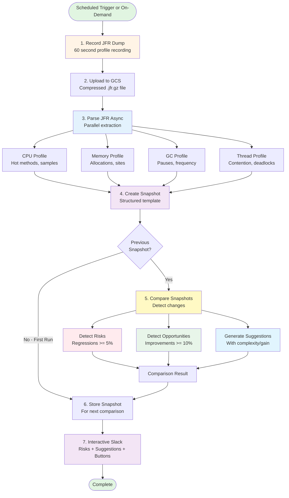
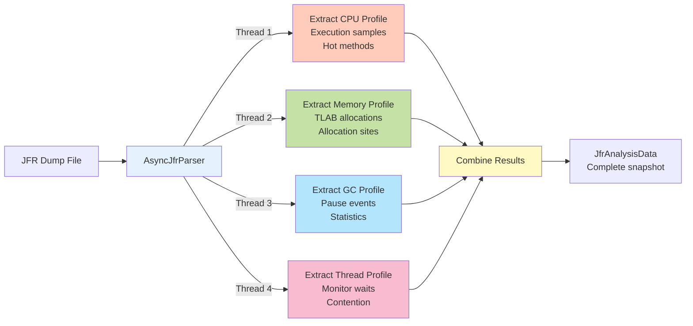
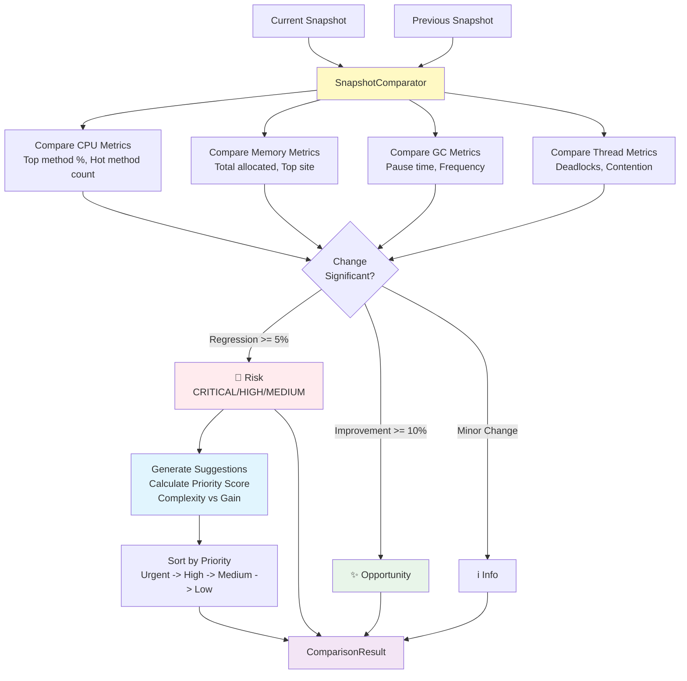
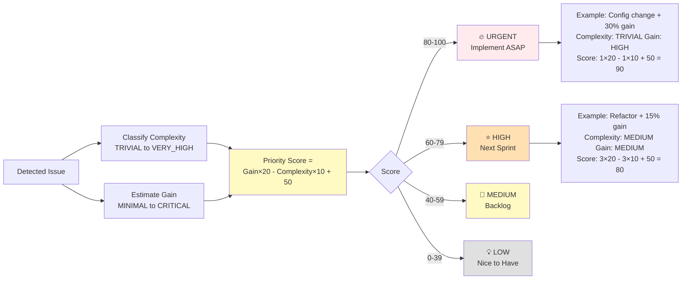

# JVM Analysis Library

Automated JVM performance analysis using Java Flight Recorder (JFR) and Claude AI. Perfect for production Kubernetes environments with distributed services.

## Features

- 📊 **JFR Recording** - Capture CPU, memory, GC, and thread data from running JVMs
- ⚡ **Async Processing** - Full CompletableFuture-based pipeline for non-blocking operations
- 🤖 **AI Analysis** - Claude AI analyzes JFR data and provides actionable optimization recommendations
- ☁️ **GCS Integration** - Automatic upload of JFR dumps to Google Cloud Storage
- 💬 **Interactive Slack** - Rich reports with action buttons, risks, and suggestions
- 🎯 **Method Whitelisting** - Focus analysis on your application code, filter out framework noise
- 🔄 **Multi-Region Support** - Analyze pods across different regions in parallel
- 📈 **Historical Comparison** - Automatically compare with previous runs to detect regressions
- ⚠️ **Risk Detection** - Flags performance regressions >= 5% with severity levels
- ✨ **Opportunity Detection** - Highlights improvements >= 10%
- 💡 **Actionable Suggestions** - Complexity vs gain analysis for prioritizing optimizations

## Architecture

### Complete Flow with Comparison



### Parallel JFR Parsing



### Comparison & Risk Detection



### Suggestion Priority Calculation



## Quick Start

### 1. Add Dependency

```xml
<dependency>
    <groupId>com.jvmanalysis</groupId>
    <artifactId>jvm-analysis-lib</artifactId>
    <version>1.0.0-SNAPSHOT</version>
</dependency>
```

### 2. Basic Usage

```java
import com.jvmanalysis.JvmAnalysisPipeline;
import java.util.Set;
import java.time.Duration;

public class MyApp {
    public static void main(String[] args) throws Exception {
        // Build the pipeline
        JvmAnalysisPipeline pipeline = new JvmAnalysisPipeline.Builder()
                .claudeApiKey(System.getenv("CLAUDE_API_KEY"))
                .slackWebhook(System.getenv("SLACK_WEBHOOK_URL"))
                .gcsBucket("my-jfr-dumps")
                .gcsProjectId("my-gcp-project")
                .packageWhitelist(Set.of("com.mycompany")) // Only analyze your code
                .recordingDuration(Duration.ofMinutes(1))
                .build();

        // Execute async analysis
        pipeline.executeAsync()
                .thenAccept(report -> {
                    System.out.println("Analysis complete!");
                    System.out.println("Report: " + report.getClaudeAnalysis());
                })
                .exceptionally(error -> {
                    System.err.println("Analysis failed: " + error.getMessage());
                    return null;
                });

        // Keep app running...
    }
}
```

### 3. With Historical Comparison (Recommended)

Track performance changes over time and get risk/opportunity alerts:

```java
JvmAnalysisPipeline pipeline = new JvmAnalysisPipeline.Builder()
        .claudeApiKey(System.getenv("CLAUDE_API_KEY"))
        .slackWebhook(System.getenv("SLACK_WEBHOOK_URL"))
        .gcsBucket("my-jfr-dumps")
        .gcsProjectId("my-gcp-project")
        .packageWhitelist(Set.of("com.mycompany"))
        .build();

// Execute with comparison
pipeline.executeWithComparisonAsync()
        .thenAccept(comparison -> {
            System.out.println("Risks: " + comparison.getRisks().size());
            System.out.println("Opportunities: " + comparison.getOpportunities().size());
            System.out.println("Suggestions: " + comparison.getSuggestions().size());
        });
```

### 4. Scheduled Analysis

For continuous monitoring, run analysis on a schedule:

```java
// Run every hour with comparison
pipeline.runScheduled(Duration.ofHours(1).toMillis());
```

## Kubernetes Deployment

### In-App Agent (Recommended)

Add to your application's startup code:

```java
@PostConstruct
public void initJvmAnalysis() {
    JvmAnalysisPipeline pipeline = new JvmAnalysisPipeline.Builder()
            .claudeApiKey(System.getenv("CLAUDE_API_KEY"))
            .slackWebhook(System.getenv("SLACK_WEBHOOK_URL"))
            .gcsBucket(System.getenv("JFR_BUCKET"))
            .gcsProjectId(System.getenv("GCP_PROJECT"))
            .packageWhitelist(Set.of("com.mycompany"))
            .build();

    // Run every 6 hours
    pipeline.runScheduled(Duration.ofHours(6).toMillis());
}
```

### Environment Variables

Set these in your Kubernetes deployment:

```yaml
apiVersion: apps/v1
kind: Deployment
metadata:
  name: my-grpc-service
spec:
  template:
    spec:
      containers:
      - name: app
        image: my-app:latest
        env:
        - name: POD_NAME
          valueFrom:
            fieldRef:
              fieldPath: metadata.name
        - name: REGION
          value: "us-central1"
        - name: CLAUDE_API_KEY
          valueFrom:
            secretKeyRef:
              name: claude-secret
              key: api-key
        - name: SLACK_WEBHOOK_URL
          valueFrom:
            secretKeyRef:
              name: slack-secret
              key: webhook-url
        - name: JFR_BUCKET
          value: "my-jfr-dumps"
        - name: GCP_PROJECT
          value: "my-gcp-project"
```

## Configuration

### Method Whitelisting

Focus analysis on your application code:

```java
.packageWhitelist(Set.of(
    "com.mycompany",
    "com.myorg.payment",
    "com.myorg.auth"
))
```

### Method Blacklisting

Exclude specific methods:

```java
JvmAnalysisConfig config = new JvmAnalysisConfig();
config.getAnalysis().setMethodBlacklist(Set.of(
    "com.mycompany.Logger.log",
    "com.mycompany.Metrics.record"
));
```

### JFR Recording Settings

```java
.recordingDuration(Duration.ofMinutes(2))  // Recording length
```

JFR settings are in `src/main/resources/jfr-profile.jfc` (default: "profile" mode)

## What Gets Analyzed?

The library extracts and Claude analyzes:

### CPU Profile
- Top hot methods (CPU time)
- Stack traces
- Execution samples

### Memory Profile
- Top allocation sites
- Object types allocated
- Total bytes allocated

### GC Profile
- GC pause times
- GC frequency
- GC type

### Thread Profile
- Thread contention
- Deadlocks (if detected)
- Blocked threads

## Historical Comparison & Risk Detection

### How It Works

1. **First Run**: Creates baseline snapshot, stores in GCS
2. **Subsequent Runs**: Compares with previous snapshot
3. **Detects Changes**: Analyzes CPU, memory, GC, thread metrics
4. **Flags Risks**: Regressions >= 5% with severity (CRITICAL, HIGH, MEDIUM, LOW)
5. **Highlights Opportunities**: Improvements >= 10%
6. **Generates Suggestions**: Actionable items with complexity/gain analysis

### Comparison Categories

#### CPU Metrics
- Top CPU method percentage change
- Number of hot methods (>5% CPU)
- Sample count variance

#### Memory Metrics
- Total bytes allocated change
- Top allocation site variance
- Allocation rate changes

#### GC Metrics
- Total pause time change
- Longest pause regression
- GC frequency increase

#### Thread Metrics
- New deadlocks detected
- Contention increase

### Example Slack Report

```
🔍 JVM Performance Comparison Report

Pod: myapp-7d9f8b5c-4xk2p | Region: us-central1
Previous: 2025-12-14 | Current: 2025-12-15

⚠️ RISKS DETECTED - 2 regression(s) need attention

🚨 [CRITICAL] CPU
> Top CPU method 'com.example.JsonSerializer.serialize' increased from 15.2% to 38.4%
> Change: +152.6% (15.2% → 38.4%)
[Acknowledge Button]

⚠️ [HIGH] MEMORY
> Memory allocation increased by 28.3% (1.2 GB → 1.5 GB)
> Change: +28.3% (1.2 GB → 1.5 GB)
[Acknowledge Button]

💡 ACTIONABLE SUGGESTIONS - Sorted by priority

🔥 URGENT Cache serialization results
> Hot method consuming 38.4% CPU. Consider caching serialized objects.
> • Complexity: `LOW - 1-4 hours`
> • Expected Gain: `HIGH - 20-40% improvement`
> • Priority Score: 90/100
> • Estimated Improvement: ~20%
[View Details Button]

⭐ HIGH Reduce allocations in RequestHandler.handle
> High allocation rate detected. Object pooling could reduce GC pressure.
> • Complexity: `MEDIUM - 1-2 days`
> • Expected Gain: `MEDIUM - 10-20% improvement`
> • Priority Score: 70/100
> • Estimated Improvement: ~15%
[View Details Button]

[View Full Report] [Run New Analysis]
```

### Suggestion Priority Scoring

Suggestions are automatically prioritized using:

**Priority = (Gain × 20) - (Complexity × 10) + 50**

- 🔥 **URGENT** (80-100): High gain, low complexity - implement immediately
- ⭐ **HIGH** (60-79): Good ROI - plan for next sprint
- 📌 **MEDIUM** (40-59): Moderate effort - backlog candidate
- 💡 **LOW** (0-39): Low priority - nice to have

### Complexity Levels

- **TRIVIAL** (< 1 hour): Config change, JVM flag adjustment
- **LOW** (1-4 hours): Simple refactor, add caching
- **MEDIUM** (1-2 days): Algorithm change, restructuring
- **HIGH** (3-5 days): Major refactor, new library integration
- **VERY_HIGH** (1+ weeks): Architecture change, system redesign

### Expected Gain

- **MINIMAL** (< 5%): Minor improvement
- **LOW** (5-10%): Noticeable improvement
- **MEDIUM** (10-20%): Significant improvement
- **HIGH** (20-40%): Major improvement
- **CRITICAL** (40%+): Game-changing improvement

## Claude Analysis Output

Claude provides:

1. **Critical Issues** - Most important problems to fix
2. **CPU Optimizations** - Specific hot method recommendations
3. **Memory Optimizations** - Allocation reduction strategies
4. **GC Tuning** - Heap size and GC algorithm recommendations
5. **Thread Optimization** - Threading issue solutions
6. **Estimated Impact** - Expected performance improvements

## Advanced Usage

### Analyze Existing JFR Files

```java
Path jfrFile = Paths.get("/tmp/my-recording.jfr");
pipeline.analyzeExistingJfrAsync(jfrFile)
        .thenAccept(report -> {
            System.out.println("Analysis: " + report.getClaudeAnalysis());
        });
```

### Record Without Analysis

Save Claude API costs by just collecting and parsing data:

```java
pipeline.recordAndParseAsync()
        .thenAccept(data -> {
            System.out.println("CPU samples: " + data.getCpuProfile().getSampleCount());
            System.out.println("Memory allocated: " +
                    data.getMemoryProfile().getTotalBytesAllocated() / 1024 / 1024 + " MB");
        });
```

### Parallel Analysis Across Pods

Analyze multiple pods simultaneously:

```java
List<CompletableFuture<OptimizationReport>> futures = pods.stream()
        .map(pod -> pod.getPipeline().executeAsync())
        .collect(Collectors.toList());

CompletableFuture.allOf(futures.toArray(new CompletableFuture[0]))
        .thenRun(() -> {
            System.out.println("All pods analyzed!");
        });
```

## Slack Report Example

```
🔍 *JVM Performance Analysis Report*

*Pod:* my-grpc-service-7d9f8b5c-4xk2p
*Region:* us-central1-a
*Timestamp:* 2025-12-15T10:30:00Z

📊 *Recording Summary*
• CPU Samples: 12,453
• Hot Methods Identified: 20
• Memory Allocated: 2,456 MB
• Allocation Sites: 20
• GC Collections: 45
• Total GC Pause: 234 ms

*JFR Dump:* `gs://my-jfr-dumps/jfr-dumps/my-pod/1702645800.jfr.gz`

🤖 *AI Analysis & Recommendations*
```
## Critical Issues
1. High CPU usage in JSON serialization (23% of total CPU time)
2. Excessive String allocations in request handling (1.2 GB allocated)

## CPU Optimizations
- Cache serialization results for frequently accessed objects
- Use StringBuilder for String concatenation in loops
...
```

## Cost Optimization

### Reduce Claude API Costs

1. **Increase recording intervals** - Run hourly instead of every 15 minutes
2. **Use whitelist aggressively** - Only analyze your code
3. **Analyze only on thresholds** - Trigger when CPU > 80% or GC pauses > 100ms

### Reduce GCS Costs

- Enable compression (default: enabled)
- Set lifecycle policies to delete old dumps
- Store only in single region

## Requirements

- Java 17+
- JDK Flight Recorder (included in OpenJDK 11+)
- Google Cloud Storage bucket
- Claude API key
- Slack webhook URL (optional)

## Building

```bash
mvn clean install
```

## License

MIT

## Support

For issues or questions, open an issue on GitHub.
